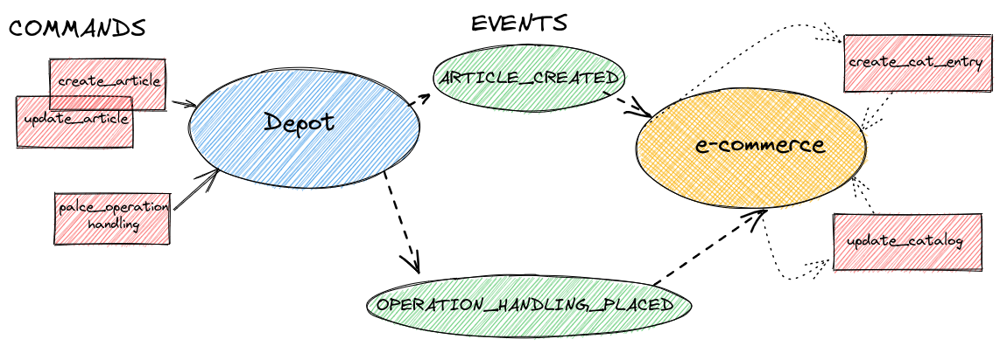
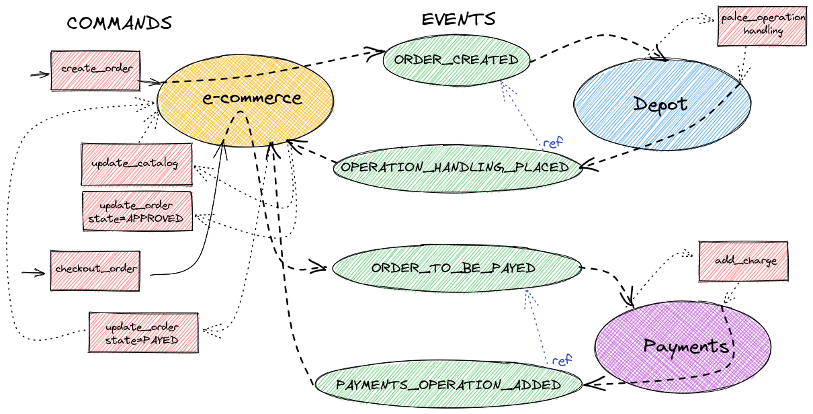
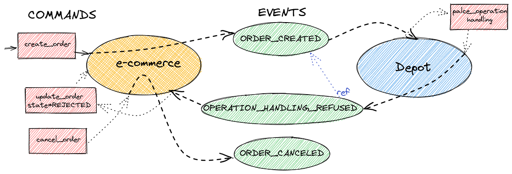
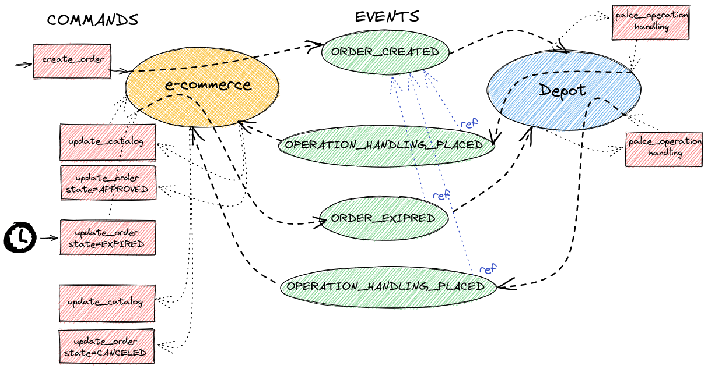

# spring-jtok-examples
spring-jtok-examples is a project to demonstrate spring-jtok 
application to a trivial ecommerce company scenario with 3
bounded-contexts/micorservices: depot, ecommerce, payments.

The repository contains:

- **depot**: a gradle spring-jtok project modelling stock depot bounded context
- **ecommerce**: a gradle spring-jtok project modelling ecommerce portal bounded context
- **payments**: a gradle spring-jtok project modelling payments system bounded context
- **integration-tests**: a maven project to test the integration between
the three microservices. It provides java integration tests and IntelliJ Idea 
http script samples. It also provides docker artifacts:
  - a *Docker file* to build
  microservices images 
  - a *docker-compose* definition to startup all the needed systems
  locally, that is:
    - *zookeeper*
    - *kafka* broker
    - *kafdrop* (a web kafka monitoring tool)
    - a single multi database *postgres* instance (on local we use a single 
    postgres to reduce resource consumption, in a production scenario each 
    microservice has its database, see k8 charts)
    - *depot* microservice (scalable to multiple instances)
    - *ecommerce* microservice (scalable)
    - *payments* microservice (scalable)
    - a *nginx* api gateway instance  
-  **k8** e directory with helms charts to deploy all the system on your Kubernetes cluster 
  
## Run all locally 
You can run all the system locally using [docker-compose](https://docs.docker.com/compose/install/)
(active experimental DOCKER_BUILDKIT to build microservices images)
```bash
export DOCKER_BUILDKIT=1
cd integration-tests/src/main/docker
docker-compose up -d

Starting docker_zookeeper_1 ... done
Starting docker_postgres_1  ... done
Starting docker_kafka_1     ... done
Starting docker_ecommerce_1 ... done
Starting docker_payments_1  ... done
Starting docker_kafdrop_1   ... done
Starting docker_depot_1     ... done
Starting docker_gateway_1   ... done
```
You can scale microservice instances
```bash
docker-compose up -d --no-recreate --scale depot=3 --scale ecommerce=2

Creating docker_ecommerce_2 ... done
Creating docker_depot_2     ... done
Creating docker_depot_3     ... done

docker-compose ps
       Name                     Command               State                                   Ports                                 
------------------------------------------------------------------------------------------------------------------------------------
docker_depot_1       sh -c exec java -cp app:ap ...   Up      8080/tcp                                                              
docker_depot_2       sh -c exec java -cp app:ap ...   Up      8080/tcp                                                              
docker_depot_3       sh -c exec java -cp app:ap ...   Up      8080/tcp                                                              
docker_ecommerce_1   sh -c exec java -cp app:ap ...   Up      8080/tcp                                                              
docker_ecommerce_2   sh -c exec java -cp app:ap ...   Up      8080/tcp                                                              
docker_gateway_1     /docker-entrypoint.sh ngin ...   Up      0.0.0.0:4000->4000/tcp,:::4000->4000/tcp, 80/tcp                      
docker_kafdrop_1     /kafdrop.sh                      Up      0.0.0.0:9999->9000/tcp,:::9999->9000/tcp                              
docker_kafka_1       /opt/bitnami/scripts/kafka ...   Up      0.0.0.0:29092->29092/tcp,:::29092->29092/tcp, 9092/tcp                
docker_payments_1    sh -c exec java -cp app:ap ...   Up      8080/tcp                                                              
docker_postgres_1    docker-entrypoint.sh postgres    Up      127.0.0.1:5432->5432/tcp                                              
docker_zookeeper_1   /opt/bitnami/scripts/zooke ...   Up      0.0.0.0:2181->2181/tcp,:::2181->2181/tcp, 2888/tcp, 3888/tcp, 8080/tcp

```
You can test the microservice endpoints and asynchronous domain events propagation using
the Intellij Idea http scripts in `integration-tests/src/main/http`
or the following curl commands:

Create payment account
```bash
curl -X POST --location "http://localhost:4000/payments/api/accounts" \
    -H "Content-Type: application/json" \
    -d "{
          \"userId\": \"panks\",
          \"notes\": \"Panks account\"
        }"
```

deposit 250 € on the account
```bash
curl -X POST --location "http://localhost:4000/payments/api/accounts/panks/deposit" \
    -H "Content-Type: application/json" \
    -d "250.00"
```

create articles in depot
```bash
curl -X POST --location "http://localhost:4000/depot/api/articles" \
    -H "Content-Type: application/json" \
    -d "{
          \"name\": \"scarpe-eleganti\",
          \"description\": \"scarpe eleganti\"
        }"
```

```bash
curl -X POST --location "http://localhost:4000/depot/api/articles" \
    -H "Content-Type: application/json" \
    -d "{
          \"name\": \"calze-seta\",
          \"description\": \"calze di seta\"
        }"
```

get the synchronized articles in the ecommerce catalog the quantity is still 0 

```bash
curl --location "http://localhost:4000/ecommerce/api/catalogArticles"
```


```json
{
  "_embedded" : {
    "catalogArticles" : [ {
      "lastOperationTs" : null,
      "name" : "scarpe-eleganti",
      "description" : "scarpe eleganti",
      "quantity" : 0,
      "_links" : {
        "self" : {
          "href" : "http://ecommerce:8080/api/catalogArticles/1"
        },
        "catalogArticle" : {
          "href" : "http://ecommerce:8080/api/catalogArticles/1"
        }
      }
    }, {
      "lastOperationTs" : null,
      "name" : "calze-seta",
      "description" : "calze di seta",
      "quantity" : 0,
      "_links" : {
        "self" : {
          "href" : "http://ecommerce:8080/api/catalogArticles/2"
        },
        "catalogArticle" : {
          "href" : "http://ecommerce:8080/api/catalogArticles/2"
        }
      }
    } ]
  },
  "_links" : {
    "self" : {
      "href" : "http://ecommerce:8080/api/catalogArticles"
    },
    "profile" : {
      "href" : "http://ecommerce:8080/api/profile/catalogArticles"
    },
    "search" : {
      "href" : "http://ecommerce:8080/api/catalogArticles/search"
    }
  }
}
```
add stocks into the depot

```bash
curl -X POST --location "http://localhost:4000/depot/api/operations/place" \
    -H "Content-Type: application/json" \
    -d "[
          {
            \"article\": \"scarpe-eleganti\",
            \"quantity\": 50
          },
          {
            \"article\": \"calze-seta\",
            \"quantity\": 250
          }
        ]"
```

see the ecommerce catalog updated with the right quantity

```bash
curl --location "http://localhost:4000/ecommerce/api/catalogArticles"
```

```json
{
  "_embedded" : {
    "catalogArticles" : [ {
      "lastOperationTs" : null,
      "name" : "scarpe-eleganti",
      "description" : "scarpe eleganti",
      "quantity" : 50,
      "_links" : {
        "self" : {
          "href" : "http://ecommerce:8080/api/catalogArticles/1"
        },
        "catalogArticle" : {
          "href" : "http://ecommerce:8080/api/catalogArticles/1"
        }
      }
    }, {
      "lastOperationTs" : null,
      "name" : "calze-seta",
      "description" : "calze di seta",
      "quantity" : 250,
      "_links" : {
        "self" : {
          "href" : "http://ecommerce:8080/api/catalogArticles/2"
        },
        "catalogArticle" : {
          "href" : "http://ecommerce:8080/api/catalogArticles/2"
        }
      }
    } ]
  },
  "_links" : {
    "self" : {
      "href" : "http://ecommerce:8080/api/catalogArticles"
    },
    "profile" : {
      "href" : "http://ecommerce:8080/api/profile/catalogArticles"
    },
    "search" : {
      "href" : "http://ecommerce:8080/api/catalogArticles/search"
    }
  }
}
```

post an order to the ecommerce api

```bash
curl -X POST --location "http://localhost:4000/ecommerce/api/order" \
    -H "Content-Type: application/json" \
    -d "{
          \"customer\": \"panks\",
          \"granTotal\": 123.56,
          \"itemValues\": [
            {\"article\": \"scarpe-eleganti\", \"quantity\": 1},
            {\"article\": \"calze-seta\", \"quantity\": 2}
          ]
        }"
```
```json
{"id":3,"globalId":"90c0cb7f-b074-47a1-aa48-5dffeb1b2324","customer":"panks","status":"CREATED","currency":"EUR","granTotal":123.56,"notes":null,"items":[{"id":4,"catalogArticle":{"id":1,"version":1,"lastOperationTs":null,"name":"scarpe-eleganti","description":"scarpe eleganti","quantity":50},"quantity":1},{"id":5,"catalogArticle":{"id":2,"version":1,"lastOperationTs":null,"name":"calze-seta","description":"calze di seta","quantity":250},"quantity":2}]}
```

check the order status

```bash
curl --location http://localhost:4000/ecommerce/api/orders/3
```
```json
{
  "globalId" : "90c0cb7f-b074-47a1-aa48-5dffeb1b2324",
  "customer" : "panks",
  "status" : "APPROVED",
  "currency" : "EUR",
  "granTotal" : 123.56,
  "notes" : null,
  "items" : [ {
    "quantity" : 1,
    "_links" : {
      "order" : {
        "href" : "http://ecommerce:8080/api/orders/3"
      },
      "catalogArticle" : {
        "href" : "http://ecommerce:8080/api/catalogArticles/1"
      }
    }
  }, {
    "quantity" : 2,
    "_links" : {
      "order" : {
        "href" : "http://ecommerce:8080/api/orders/3"
      },
      "catalogArticle" : {
        "href" : "http://ecommerce:8080/api/catalogArticles/2"
      }
    }
  } ],
  "_links" : {
    "self" : {
      "href" : "http://ecommerce:8080/api/orders/3"
    },
    "order" : {
      "href" : "http://ecommerce:8080/api/orders/3"
    }
  }
}
```

the order status is APPROVED because articles goods are in stock. 
You can check the stock quantity updated on the depod side

```bash
curl --location http://localhost:4000/depot/api/articles
```

```json
{
  "_embedded" : {
    "articles" : [ {
      "lastOperationTs" : 1647601174494,
      "name" : "scarpe-eleganti",
      "description" : "scarpe eleganti",
      "handlingList" : [ {
        "quantity" : 50,
        "timestamp" : 1647601026608,
        "_links" : {
          "operation" : {
            "href" : "http://depot:8080/api/operations/4"
          },
          "article" : {
            "href" : "http://depot:8080/api/articles/1"
          }
        }
      }, {
        "quantity" : -1,
        "timestamp" : 1647601174492,
        "_links" : {
          "operation" : {
            "href" : "http://depot:8080/api/operations/7"
          },
          "article" : {
            "href" : "http://depot:8080/api/articles/1"
          }
        }
      } ],
      "stockQuantity" : 49,
      "_links" : {
        "self" : {
          "href" : "http://depot:8080/api/articles/1"
        },
        "article" : {
          "href" : "http://depot:8080/api/articles/1"
        }
      }
    }, {
      "lastOperationTs" : 1647601174494,
      "name" : "calze-seta",
      "description" : "calze di seta",
      "handlingList" : [ {
        "quantity" : 250,
        "timestamp" : 1647601026609,
        "_links" : {
          "operation" : {
            "href" : "http://depot:8080/api/operations/4"
          },
          "article" : {
            "href" : "http://depot:8080/api/articles/3"
          }
        }
      }, {
        "quantity" : -2,
        "timestamp" : 1647601174493,
        "_links" : {
          "operation" : {
            "href" : "http://depot:8080/api/operations/7"
          },
          "article" : {
            "href" : "http://depot:8080/api/articles/3"
          }
        }
      } ],
      "stockQuantity" : 248,
      "_links" : {
        "self" : {
          "href" : "http://depot:8080/api/articles/3"
        },
        "article" : {
          "href" : "http://depot:8080/api/articles/3"
        }
      }
    } ]
  },
  "_links" : {
    "self" : {
      "href" : "http://depot:8080/api/articles"
    },
    "profile" : {
      "href" : "http://depot:8080/api/profile/articles"
    },
    "search" : {
      "href" : "http://depot:8080/api/articles/search"
    }
  }
}
```

proceed to pay the order

```bash
curl -X PATCH --location "http://localhost:4000/ecommerce/api/order/3/checkout"
```

check the order status to PAYED

```bash
curl --location http://localhost:4000/ecommerce/api/orders/3
```

```json
{
  "globalId" : "90c0cb7f-b074-47a1-aa48-5dffeb1b2324",
  "customer" : "panks",
  "status" : "PAYED",
  "currency" : "EUR",
  "granTotal" : 123.56,
  "notes" : null,
  "items" : [ {
    "quantity" : 1,
    "_links" : {
      "order" : {
        "href" : "http://ecommerce:8080/api/orders/3"
      },
      "catalogArticle" : {
        "href" : "http://ecommerce:8080/api/catalogArticles/1"
      }
    }
  }, {
    "quantity" : 2,
    "_links" : {
      "order" : {
        "href" : "http://ecommerce:8080/api/orders/3"
      },
      "catalogArticle" : {
        "href" : "http://ecommerce:8080/api/catalogArticles/2"
      }
    }
  } ],
  "_links" : {
    "self" : {
      "href" : "http://ecommerce:8080/api/orders/3"
    },
    "order" : {
      "href" : "http://ecommerce:8080/api/orders/3"
    }
  }
}
```

and check the account balance on the payments microservice

```bash
curl --location http://localhost:4000/payments/api/accounts/panks/balance
```

```json
{
  "id": 1,
  "version": 2,
  "userId": "panks",
  "lastOperationTs": 1647601849224,
  "notes": "Panks account",
  "operations": [
    {
      "id": 2,
      "version": 0,
      "amount": 250,
      "timestamp": 1647601840413,
      "refId": "aea464f7-c412-494c-ba3b-eeab62771978",
      "refKey": "api"
    },
    {
      "id": 3,
      "version": 0,
      "amount": -123.56,
      "timestamp": 1647601849224,
      "refId": "81e8272f-fe2c-46c5-b59c-7cbe99ed7ba5",
      "refKey": "90c0cb7f-b074-47a1-aa48-5dffeb1b2324"
    }
  ],
  "balance": 126.44
}
```
Nice job! You have completed some eventually consistent distributed sagas among the deployed microservices     

Stop and remove containers cleaning anonymous volumes

```bash
docker-compose down -v
```

To better understand the underlining event workflow we report 
some sagas graphical representations:

Depot articles to ecommerce catalog saga:



Order and depot handling sagas 



Order rejected for not available stock on depot 



Order expired for user latency expired or session abandoned

